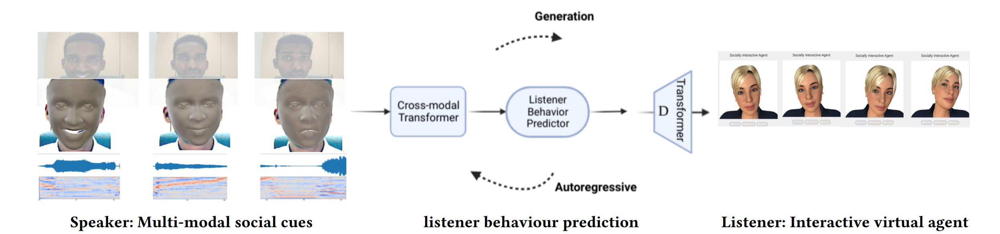

# ReNeLiB: Real-time Neural Listening Behavior Generation for Socially Interactive Agents



## Quick Links
- [Demo Video](#demo-video)
- [The Paper](https://doi.org/10.1145/3577190.3614133)
- [Code on GitHub](https://github.com/Daksitha/ReNeLib)
- [Data](#data)


## Demo Video
[]((https://youtu.be/yEM8RjMW2VI)) 

## Abstract

Flexible and natural nonverbal reactions to human behavior remain a challenge for socially interactive agents (SIAs), especially those animated using predominantly hand-crafted rules. Our toolkit introduces a novel approach to enhancing the real-time, machine learning-based, conversational behavior generation capabilities of SIAs, considering the challenging real-time requirements of human-agent interaction scenarios. 

- **Real-time Feature Extraction:** Captures multi-modal social cues from the user.
- **Behavior Generation:** Utilizes a state-of-the-art neural network approach.
- **Visualization:** Supports both FLAME-based and Apple ARKit-based interactive agents.

We also provide new pre-trained behavioral generation models based on real-life psychotherapy interactions, enabling domain-specific listening behaviors generation. Our toolkit will be publicly available, serving as a valuable resource for researchers.

## Installation

### Using Conda

```bash
conda env create python=3.8 --file environment.yml
```
Or alternatively:

```bash
conda env create python=3.8 --file conda_spec_file.txt
```
If any dependency installation fails, particularly `pytorch3d` and `torch`, install them after initiating the conda environment. Ensure to check your GPU's [CUDA compatibility](https://docs.nvidia.com/deploy/cuda-compatibility/) and install the correct Nvidia drivers and CUDA toolkits. Follow the installation instructions for [pytorch](https://pytorch.org/) and [pytorch3d](https://github.com/facebookresearch/pytorch3d/blob/main/INSTALL.md) accordingly.

### Docker Container

Execute the following commands:

```bash
docker run --rm -it pytorch/pytorch:1.11.0-cuda11.3-cudnn8-runtime
$conda install -c fvcore -c iopath -c conda-forge fvcore iopath
$conda install pytorch3d=0.7.0 -c pytorch3d
$ipython
$from pytorch3d.structures import Meshes
```

## Demo 

### Running the System

- **Module 1: Behaviour Generation**

  Navigate to `behaviour_predictor/behaviour/online_with_webcam_microphone` and run:

  ```bash
  python behaviour_predictor_with_VAD.py
  ```
- **Module 2: FastAPI Backend**

  Navigate to `IVA/fastApi_backend`, ensure all FastAPI dependencies are installed, and start the server:

  ```bash
  python fast_api_server.py
  ```
  After starting the backend, connect the front end with Gloria to test the communication. Navigate to `IVA/front-end` and start `index.html`. Ensure your browser and JavaScript dependencies are up-to-date. Click the connect button to establish a connection to the backend once Gloria is visible on your web browser.

- **Module 3: FLAME Webcam Extractor**

  Navigate to `extractors/src/feature_extraction_online` and start:

  ```bash
  python webcam_flame_extractor_simple_version.py
  ```
  Then, start mfcc extractor:

  ```bash
  python microphone_mfcc_extractor_with_VAD.py
  ```
  These modules stream data to the behavior generator for behavior prediction.


## Data

To access the therapy dataset and pre-trained models, please contact me via email: [daksitha.withanage.don@uni-a-de](mailto:daksitha.withanage.don@uni-a-de) or [daksitha.withanage@gmail.com](mailto:daksitha.withanage@gmail.com)

## Cite Our Paper

If you utilize our work, please cite our paper:

```bibtex
@inproceedings{10.1145/3577190.3614133,
  author = {Withanage Don, Daksitha Senel and M"{u}ller, Philipp and Nunnari, Fabrizio and Andr'{e}, Elisabeth and Gebhard, Patrick},
  title = {ReNeLiB: Real-Time Neural Listening Behavior Generation for Socially Interactive Agents},
  year = {2023},
  isbn = {9798400700552},
  publisher = {Association for Computing Machinery},
  address = {New York, NY, USA},
  url = {https://doi.org/10.1145/3577190.3614133},
  doi = {10.1145/3577190.3614133},
  pages = {507–516},
  numpages = {10},
  location = {Paris, France},
  series = {ICMI '23}
}
```

## Acknowledgements

Special thanks to [Radek Daněček](https://emoca.is.tue.mpg.de/) and [Evone Ng](http://people.eecs.berkeley.edu/~evonne_ng/) for their invaluable tips and code contributions.

For further collaborations or queries, feel free to [contact me](mailto:daksitha.withanage@gmail.com).
